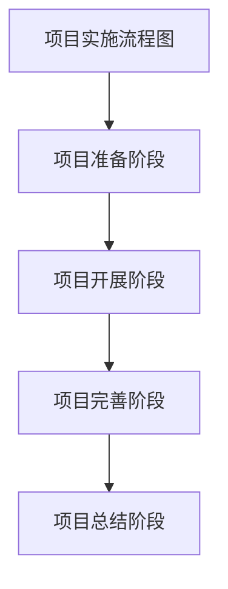
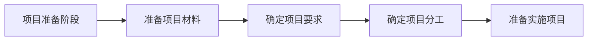
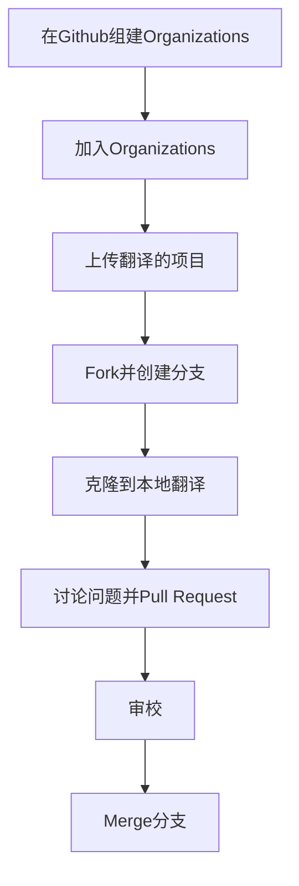
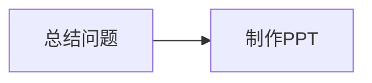

#                                                              项目实施流程

## 1.项目准备阶段

•准备项目材料：包括下载翻译项目文件包。

•确定项目要求：包括确定项目的目标和利用Github交付。

•确定项目分工：包括翻译分工，审校；平行文本搜索;术语表制作；项目安排计划表的书写；ppt制作等。

## 2.项目开展阶段

项目实施阶段

•在Github组建Organizations：组长在GitHub当中创建小组。

•加入Organizations：小组成员加入到Github小组当中。

•上传翻译的项目：组长将Fork的文件包上传到小组，并发布任务及分工安排。

•Fork并创建分支：小组成员Fork翻译文件并创建自己的分支。

•克隆到本地翻译：小组成员将分支当中的文件下载到本地并进行翻译。

•讨论问题并Pull Request：小组成员讨论问题并发布issue，翻译好后Pull Request到小组项目库。

•审校：审校人员进行审校，完善翻译。

•Merge分支：组长同意Merge合并分支。

## 3.项目完善阶段

## 4.项目总结阶段

